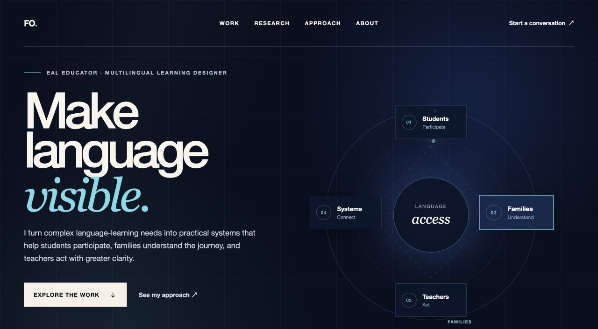

# Multilingual Learning Portfolio

An immersive portfolio for Federico Orozco's research, educational products, and practical systems for multilingual learners, families, and teachers.

## Project status

**Phase 1: foundation and source audit** and **Phase 2: narrative and information architecture** are complete. **Phase 3: visual concept and interaction prototype** now includes a working vertical slice of the immersive hero and first flagship story.

The current source-of-truth audit is maintained in [`docs/phase-1-source-audit.md`](docs/phase-1-source-audit.md).

The proposed MVP narrative, sitemap, and copy are maintained in [`docs/phase-2-narrative-and-information-architecture.md`](docs/phase-2-narrative-and-information-architecture.md).

The Phase 3 concept, implementation notes, verification, and previews are maintained in [`docs/phase-3-visual-prototype.md`](docs/phase-3-visual-prototype.md).

## Local prototype

```bash
npm install
npm run dev
```

Production verification:

```bash
npm run build
```



## Working direction

**Make language visible.**

The MVP will connect Federico's work across four audiences—students, families, teachers, and school systems—while using three flagship stories to demonstrate how research and classroom experience become practical products.
