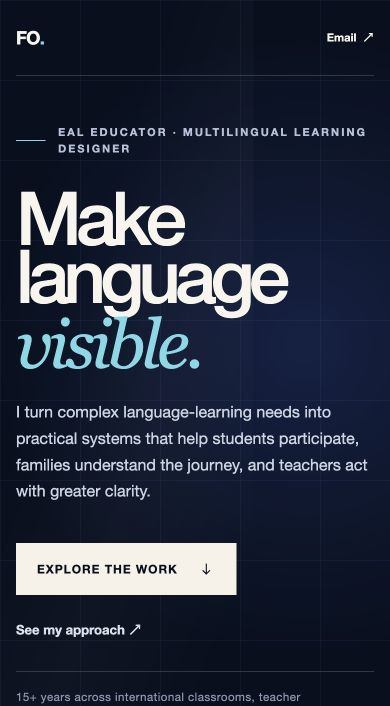

# Phase 3 visual concept and interaction prototype

**Status:** Working vertical slice complete  
**Date:** 2026-08-09  
**Prototype scope:** First viewport → point of view → work transition → LinguaFlow Teacher lead flagship → multilingual-family ecosystem

## Concept

> Language needs begin as disconnected signals. Federico's work makes the relationships visible and turns them into practical paths for participation, understanding, action, and support.

The visual direction adapts the immersive confidence and spatial storytelling Federico admired in Lusion without reproducing its 3D objects, layouts, typography, or identity.

## Signature moment

The **Language Access Ecosystem** is the portfolio's signature interaction.

- Students, families, teachers, and systems occupy one connected field.
- Pointer movement produces restrained depth rather than controlling navigation.
- Hover, focus, and click reveal a specific principle for each audience.
- The central “Language access” idea remains stable while the supporting audience changes.
- On narrow mobile screens, the spatial model becomes a clear vertical sequence.
- All meaning exists as semantic HTML and remains available without motion.

## Visual system

### Color

- Deep ink establishes an immersive, professional opening.
- Warm paper creates a calmer editorial reading environment.
- Cyan marks language access and the active relationship.
- Blue signals research, systems, and product structure.
- Warm cream keeps actions human rather than overtly technological.

### Typography

- A direct grotesk-style system face carries product clarity and professional information.
- A serif italic accent gives “visible,” “access,” and reflective language a human editorial voice.
- Large display type is restricted to narrative turns rather than repeated in every section.

### Composition

- The first viewport uses a two-part composition: positioning on the left, ecosystem on the right.
- Reading sections shift into asymmetric editorial grids.
- The family story moves from research language into authentic product evidence.
- The interface screenshot is presented as a browser artifact, not a decorative card.

## Implemented prototype

- React, TypeScript, and Vite foundation.
- Responsive immersive hero.
- Four interactive ecosystem controls.
- Pointer-responsive depth on capable devices.
- Keyboard-accessible buttons and links.
- Mobile-specific vertical ecosystem composition.
- Reduced-motion fallbacks.
- Point-of-view and work transition sections.
- LinguaFlow Teacher lead narrative and art-directed mentor-text workspace.
- Family ecosystem narrative.
- Research-to-product orbital diagram.
- Research-to-action family product journey.
- Carefully qualified early-feedback evidence.
- Confirmed portfolio email: `forozc1@gmail.com`.
- GitHub Pages-compatible base path.

## Previews

### Desktop hero

### Mobile hero

### Lead product moment: LinguaFlow Teacher

The prototype uses a purpose-built interface composition to show the five instructional decisions, the editable mentor text, highlighted language features, and the teaching move in one readable frame. This communicates the product's value more clearly than a flat page capture.

## Responsive behavior

### Desktop

- Full ecosystem diagram with ambient orbits and interactive nodes.
- Persistent navigation and visible contact action.
- Product evidence and early feedback share one composed visual field.

### Tablet

- The ecosystem remains spatial but contracts.
- The family narrative reduces its column gap and product evidence stacks when necessary.

### Mobile

- Header uses a concise “Email” action.
- The hero retains the full positioning and primary action.
- Ecosystem nodes become a vertical, touch-friendly sequence.
- The active audience thought appears directly after the controls.
- Family product evidence and feedback stack into one reading column.

## Motion behavior

Motion is used to:

- suggest that the four audiences belong to one living system;
- reveal the relationship currently being explored;
- orient visitors when content enters the viewport;
- move from an abstract problem into product evidence.

Motion is not required for reading, navigation, or understanding. Under `prefers-reduced-motion`, ambient rotation, sheen, pointer depth, smooth scrolling, and entrance movement are removed or reduced to immediate state changes.

## Accessibility decisions

- Skip link targets selected work.
- Header navigation has an explicit accessible label.
- Ecosystem controls use real buttons and `aria-pressed` state.
- Active ecosystem explanation uses a polite live region.
- Contact and work actions are normal links.
- Focus states are visible against light and dark surfaces.
- Screenshot alt text describes the product evidence being shown.
- Early-feedback figures retain sample size and limitation context.
- Mobile uses touch targets larger than 44 pixels.

## Verification completed

- `npm run build` succeeds.
- TypeScript compilation succeeds.
- Vite production build succeeds.
- Desktop hero visually inspected at a 1280-pixel viewport.
- Mobile hero and vertical ecosystem visually inspected at a 390-pixel viewport.
- All four ecosystem controls render and update the active explanation.
- Family interface asset loads successfully.
- Contact link resolves to `mailto:forozc1@gmail.com`.
- No horizontal overflow at inspected desktop or mobile viewports.
- Fresh desktop and mobile verification tabs produced no console warnings or errors.

## Current constraints

- This is a vertical slice, not the complete MVP.
- EALDesk, Scaffold, supporting tools, full research, approach, about, and footer remain to be implemented.
- The current family-guide capture is a clean reference asset but should eventually be replaced by a fresh production capture at final art-directed dimensions.
- Runtime reduced-motion emulation was not available in the current browser workflow; implementation was verified in code and still needs a dedicated runtime pass.
- Custom font selection and licensing remain Phase 4 decisions; the prototype uses resilient system typography.
- Dedicated static case-study routes remain Phase 4 work.

## Phase 3 decision

The concept is strong enough to scale into the MVP because:

1. the first viewport communicates identity, purpose, audience, and action;
2. the signature interaction is specific to Federico's language-access model;
3. the transition into authentic product evidence is coherent;
4. the mobile experience preserves the idea without imitating desktop spatially;
5. the effect does not control or delay navigation.

## Next implementation sequence

1. Build the EALDesk flagship chapter using curriculum fragments resolving into one workshop path.
2. Build the Scaffold Beta chapter using rough notes resolving into editable supports.
3. Add LinguaFlow Teacher and Classroom Support Compass as focused tools.
4. Add research, approach, experience, credentials, and contact.
5. Add static case-study routes and final screenshot art direction.
6. Complete performance, accessibility, reduced-motion, and cross-browser verification.
